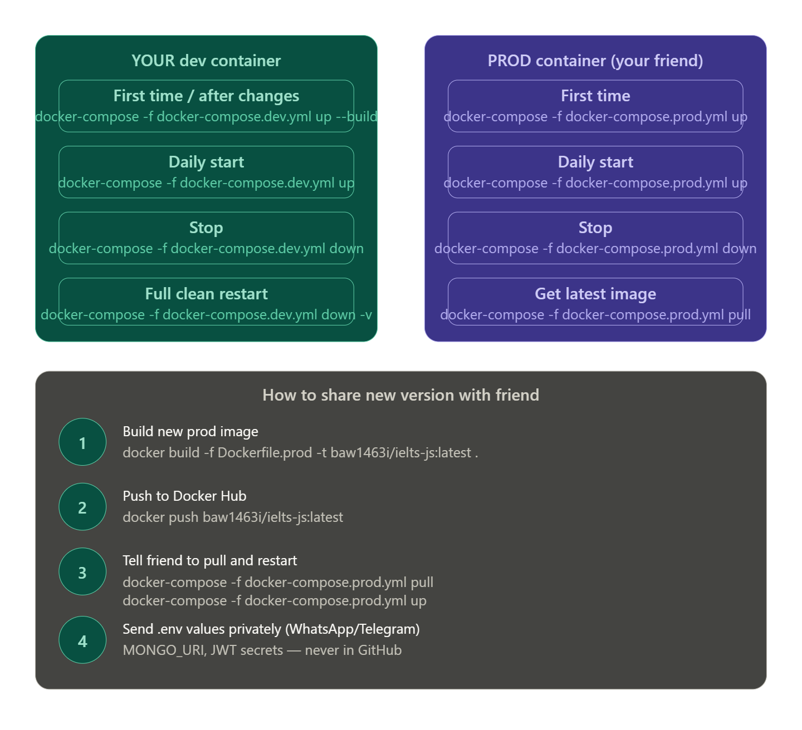

# Docker Setup Guide

## For YOU (dev mode — hot reload)

```bash
docker-compose -f docker-compose.dev.yml up --build
```

Your source code is mounted live. Edit files → changes reflect instantly. No rebuild needed.

---

## When you want to share with your friend (build prod image)

```bash
# 1. Build the prod image
docker build -f Dockerfile.prod -t YOUR_DOCKERHUB_USERNAME/express-app:latest .

# 2. Push to Docker Hub
docker push YOUR_DOCKERHUB_USERNAME/express-app:latest
```

Do this whenever you have a stable version to share.

---

## For your FRIEND

```bash
# 1. Clone the repo
git clone https://github.com/YOUR_USERNAME/YOUR_REPO.git
cd YOUR_REPO

# 2. Copy env template and fill in values (you send real values privately)
cp .env.example .env

# 3. Start everything
docker-compose up
```

That's it. The backend image is pulled from Docker Hub automatically.

---

## File purposes

| File | Purpose | Commit to Git? |
|------|---------|----------------|
| Dockerfile.dev | Your dev container | YES |
| Dockerfile.prod | Friend's container | YES |
| docker-compose.dev.yml | Your local stack | YES |
| docker-compose.yml | Friend's stack | YES |
| .env.example | Env template | YES |
| .env | Real secrets | NO — never |

Here's your complete reference for everything:---

**Your daily routine as a developer:**

```bash
# Morning — start work
docker-compose -f docker-compose.dev.yml up

# Evening — stop work
docker-compose -f docker-compose.dev.yml down
```

Only use `--build` when you install a new package or change the Dockerfile. Normal code changes don't need it because your source is live-mounted.

---

**Your friend's one-time setup:**

```bash
# 1. Clone repo
git clone https://github.com/baw1463i/YOURREPO.git
cd YOURREPO

# 2. Create .env
cp .env.example .env
# fill in values you send privately

# 3. Start
docker-compose -f docker-compose.prod.yml up
```

Every time you push a new image, they just run:
```bash
docker-compose -f docker-compose.prod.yml pull
docker-compose -f docker-compose.prod.yml up
```

